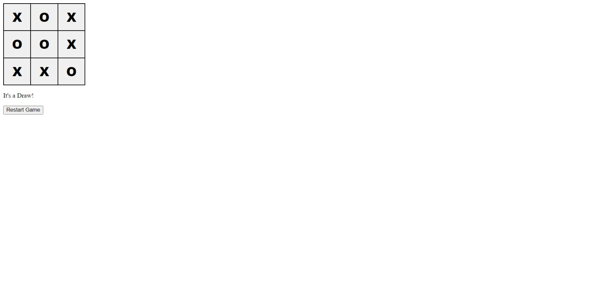

# 05: React, Prettier and ESLint

If you get stuck, a completed version of this project is available in the **exemplar** directory.

## Preparation

1. Create a new project using **Create Vite App**:

```bash
npm init vite@latest
```

2. When prompted, select the following options:

- Project name: **05-react-prettier-and-eslint**
- Framework: **React**
- Variant: **JavaScript + SWC**

3. `cd` into **05-react-prettier-and-eslint**, run `npm install` and open it in your code editor.

## React

Refresh your memory on the following topics:

1. https://github.com/otago-polytechnic-bit-courses/ID607001-intro-app-dev-concepts/tree/s1-24/lecture-notes/10-react-1
2. https://github.com/otago-polytechnic-bit-courses/ID607001-intro-app-dev-concepts/tree/s1-24/lecture-notes/11-react-2
3. https://github.com/otago-polytechnic-bit-courses/ID607001-intro-app-dev-concepts/tree/s1-24/lecture-notes/12-react-3

**Note:** You do not need to complete the **formative assessments**. However, you are welcome to do so.

### useRef

**useRef** is a hook that returns a mutable ref object whose `.current` property is initialised to the passed argument (`initialValue`). The returned object will persist for the full lifetime of the component.

```jsx
import { useRef } from "react";

const Counter = () => {
  let ref = useRef(0);

  const handleClick = () => {
    ref.current++;
    console.log(`You clicked ${ref.current} times`);
  };

  return <button onClick={handleClick}>Click Me!</button>;
};

export default Counter;
```

**Note:** Do not read or write `ref.current` during rendering. For example:

```jsx
// This is not allowed
const Counter = () => {
  let ref = useRef(0);
  ref.current++;

  return (
    <>
      <button>Click Me!</button>
      <p>You clicked {ref.current} times</p>
    </>
  );
};

export default Counter;
```

## Prettier

You are going to extend your knowledge of **Prettier**. Instead of formatting every file in your project, you can configure **Prettier** to only format files that are staged for commit.

1. Install the following package:

```bash
npm install pretty-quick --save-dev
```

2. Add the following script to your `package.json` file:

```json
"pretty-quick": "pretty-quick --staged"
```

3. Run the following command:

```bash
npm run pretty-quick
```

## ESLint

**ESLint** is a popular **linting** tool that can be used to check your code for errors and enforce a consistent coding style. It is highly configurable and can be extended with **plugins**. When you create a new **React** project using **Create Vite App**, **ESLint** is already configured for you. However, not configured to work with **Prettier**.

1. Install the following packages:

```bash
npm install eslint eslint-config-prettier eslint-plugin-prettier prettier --save-dev
```

2. Update your `.eslintrc.cjs` file:

```js
module.exports = {
  root: true,
  env: { browser: true, es2020: true },
  extends: [
    "eslint:recommended",
    "plugin:react/recommended",
    "plugin:react/jsx-runtime",
    "plugin:react-hooks/recommended",
    "prettier",
  ],
  ignorePatterns: ["dist", ".eslintrc.cjs"],
  parserOptions: { ecmaVersion: "latest", sourceType: "module" },
  settings: { react: { version: "18.2" } },
  plugins: ["react-refresh", "prettier"],
  rules: {
    "react-refresh/only-export-components": [
      "warn",
      { allowConstantExport: true },
    ],
    "prettier/prettier": "warn",
  },
};
```

3. Run the following command:

```bash
npm run lint
```

4. You should see errors and warnings. The errors and warnings are potentially fixable by updating the `lint` script in your `package.json` file:

```json
"eslint . --ext js,jsx --report-unused-disable-directives --max-warnings 0 --fix"
```

then running the following command:

```bash
npm run lint
```

## Formative Assessment

Before you start, create a new branch called **05-formative-assessment**.

If you get stuck on any of the following tasks, feel free to use **ChatGPT** permitting, you are aware of the following:

- If you provide **ChatGPT** with a prompt that is not refined enough, it may generate a not-so-useful response
- Do not trust **ChatGPT's** responses blindly. You must still use your judgement and may need to do additional research to determine if the response is correct
- Acknowledge that you are using **ChatGPT**. In the **README.md** file, please include what prompt(s) you provided to **ChatGPT** and how you used the response(s) to help you with your work

## Task Tahi

If you have not already, implement the code examples above before you move on to **Formative Assessment Submission**.

## Task Rua

In the `src/components` directory, create three new files called `Square.jsx`, `Board.jsx` and `Game.jsx`.

In `Square.jsx`, add the following code:

```jsx
import PropTypes from "prop-types"; // Make sure you install prop-types -> npm install prop-types

const Square = (props) => {
  const style = {
    border: "1px solid #000",
    cursor: "pointer",
    fontSize: "30px",
    fontWeight: "800",
    outline: "none",
  };

  return (
    <button style={style} onClick={props.onClick}>
      {props.value}
    </button>
  );
};

Square.propTypes = {
  onClick: PropTypes.func.isRequired,
  value: PropTypes.string,
};

export default Square;
```

In `Board.jsx`, add the following code:

```jsx
import PropTypes from "prop-types";

import Square from "./Square";

const Board = (props) => {
  const style = {
    border: "1px solid #000",
    display: "grid",
    gridTemplate: "repeat(3, 1fr) / repeat(3, 1fr)",
    height: "200px",
    width: "200px",
  };

  return (
    <div style={style}>
      {props.squares.map((square, idx) => (
        <Square key={idx} value={square} onClick={() => props.onClick(idx)} />
      ))}
    </div>
  );
};

Board.propTypes = {
  onClick: PropTypes.func.isRequired,
  squares: PropTypes.array.isRequired,
};

export default Board;
```

In the `src` directory, create a new directory called `utils`. In the `utils` directory, create a new file called `calculateGameState.js` and add the following code:

```js
const calculateGameState = (squares) => {
  const lines = [
    [0, 1, 2],
    [3, 4, 5],
    [6, 7, 8],
    [0, 3, 6],
    [1, 4, 7],
    [2, 5, 8],
    [0, 4, 8],
    [2, 4, 6],
  ];

  for (let s = 0; s < lines.length; s++) {
    const [a, b, c] = lines[s];
    if (squares[a] && squares[a] === squares[b] && squares[a] === squares[c]) {
      return squares[a];
    }
  }
  return null;
};

export default calculateGameState;
```

In `Game.jsx`, add the following code:

```jsx
import { useState } from "react";

import Board from "./Board";

import calculateGameState from "../utils/calculateGameState";

const Game = () => {
  const style = {
    width: "200px",
  };

  const [squares, setSquares] = useState(Array(9).fill(null));
  const [xIsNext, setXIsNext] = useState(true);
  const [gameStarted, setGameStarted] = useState(false);

  const winner = calculateGameState(squares);

  const handleClick = (idx) => {
    const squaresCopy = [...squares];
    if (winner || squaresCopy[idx]) return;
    squaresCopy[idx] = xIsNext ? "X" : "O";
    setSquares(squaresCopy);
    setXIsNext(!xIsNext);
  };

  const restartGame = () => {
    setSquares(Array(9).fill(null));
    setGameStarted(true);
  };

  return (
    <>
      {gameStarted && <Board squares={squares} onClick={handleClick} />}
      <div style={style}>
        {gameStarted && (
          <p>
            {winner
              ? `Winner: ${winner}`
              : `Next Player: ${xIsNext ? "X" : "O"}`}
          </p>
        )}
        <button
          onClick={restartGame}
        >
          {gameStarted ? "Restart Game" : "Start Game"}
        </button>
      </div>
    </>
  );
};

export default Game;
```

In `App.jsx`, add the following code:

```jsx
import Game from "./components/Game";

const App = () => <Game />;

export default App;
```

Here are some screenshots of the final result:


## Task Toru

Write code that displays a message when the game is a draw.



# Formative Assessment Submission

Create a new pull request and assign **grayson-orr** to review your practical submission. Please do not merge your own pull request.
