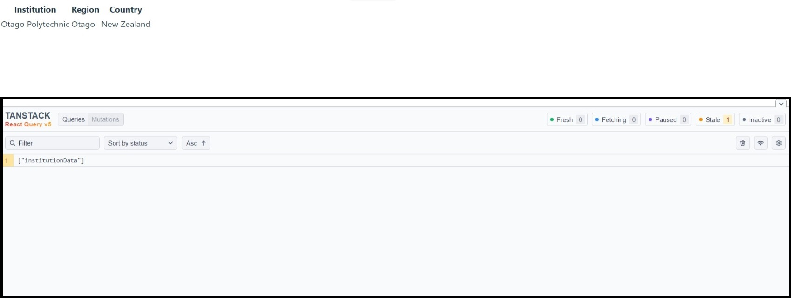
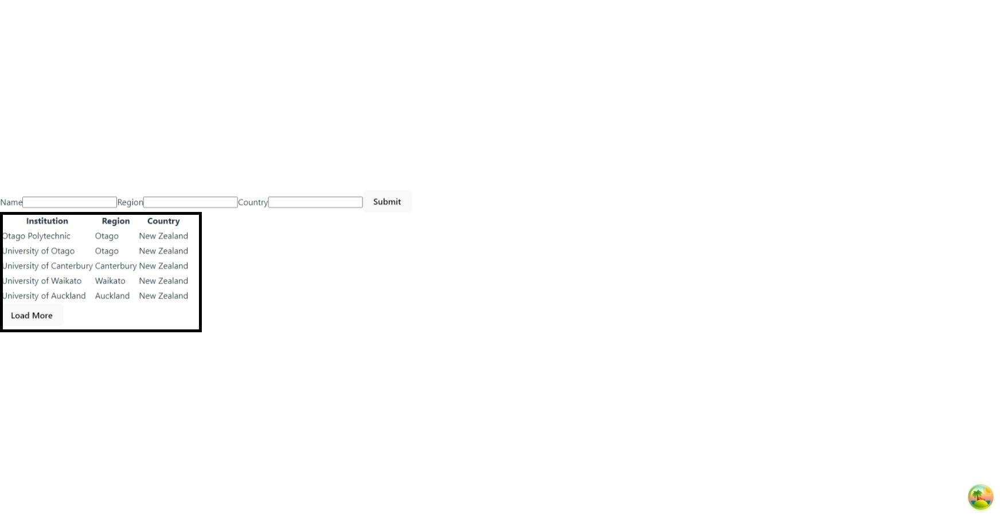
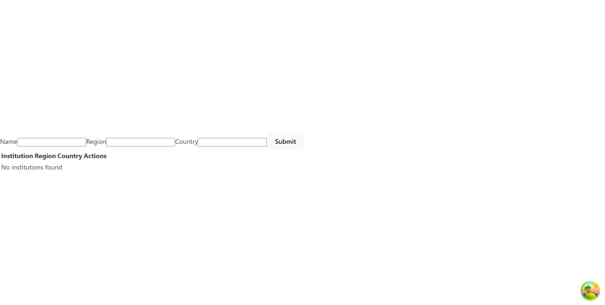
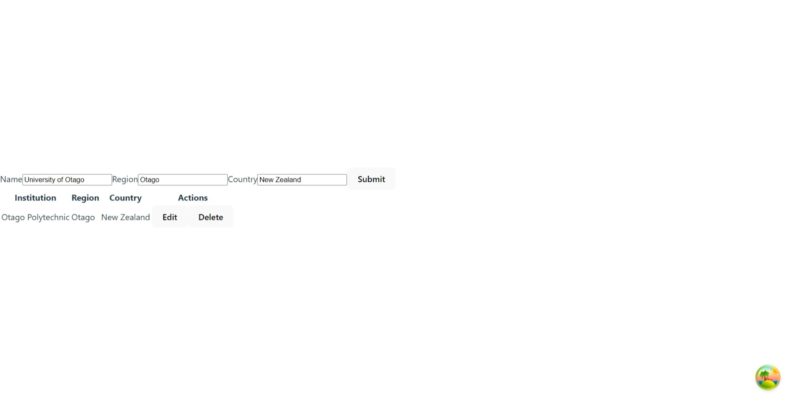

# 07: React Query

If you get stuck, a completed version of this project is available in the **exemplar** directory.

## Preparation

1. Create a new project using **Create Vite App**:

```bash
npm init vite@latest
```

2. When prompted, select the following options:

- Project name: **07-react-query**
- Framework: **React**
- Variant: **JavaScript + SWC**

3. `cd` into **07-react-query**, run `npm install` and open it in your code editor.

## React Query

**React Query** is a library that helps you fetch, cache and update data in your React applications. It is a great alternative to Redux and other state management libraries. It is also a great alternative to the `fetch` API and `axios` for fetching data from APIs.

### Setup

1. To get started, install the library:

```bash
npm install @tanstack/react-query
```

2. In `src/main.jsx`, import the `QueryClientProvider` and `QueryClient` from `@tanstack/react-query`:

```js
import { QueryClientProvider, QueryClient } from "@tanstack/react-query";
```

3. Create a new instance of `QueryClient`:

```js
export const queryClient = new QueryClient();
```

4. Wrap the `App` component in the `QueryClientProvider`:

```js
<React.StrictMode>
  <QueryClientProvider client={queryClient}>
    <App />
  </QueryClientProvider>
</React.StrictMode>,
```

### Query Example

In `src/App.jsx`, update the code to the following:

```js
import { useQuery } from "@tanstack/react-query";

const App = () => {
  const { isLoading, err, data } = useQuery({
    queryKey: ["institutionData"],
    queryFn: () =>
      fetch(
        "https://id607001-graysono-wbnj.onrender.com/api/institutions"
      ).then((res) => res.json()),
  });

  if (isLoading) return "Loading...";
  if (err) return `An error has occurred: ${err.message}`;

  return (
    <>
      <table>
        <thead>
          <tr>
            <th>Institution</th>
            <th>Region</th>
            <th>Country</th>
          </tr>
        </thead>
        <tbody>
          {data.msg ? (
            <tr>
              <td colSpan="3">{data.msg}</td>
            </tr>
          ) : (
            data.data.map((institution) => (
              <tr key={institution.id}>
                <td>{institution.name}</td>
                <td>{institution.region}</td>
                <td>{institution.country}</td>
              </tr>
            ))
          )}
        </tbody>
      </table>
    </>
  );
};

export default App;
```


### Developer Tools

1. Install the `react-query-devtools` package:

```bash
npm install @tanstack/react-query-devtools --save-dev
```

2. In `src/main.jsx`, import the `ReactQueryDevtools` component from `@tanstack/react-query-devtools`:

```js
import { ReactQueryDevtools } from "@tanstack/react-query-devtools";
```

3. Add the `ReactQueryDevtools` component to the `QueryClientProvider`:

```js
<React.StrictMode>
  <QueryClientProvider client={queryClient}>
    <App />
    <ReactQueryDevtools initialIsOpen={false} />
  </QueryClientProvider>
</React.StrictMode>,
```

Click on the icon in the bottom right corner to open the developer tools.




## Mutation Example

1. In `src/App.jsx`, import the `useMutation` hook from `@tanstack/react-query` and `queryClient` from `src/main.jsx`:

```js
// ...
import { useQuery, useMutation } from "@tanstack/react-query";

import { queryClient } from "./main";
```

2. Using the `useMutation` hook, create a new mutation:

```js
const App = () => {
  // ...
  const postMutation = useMutation({
    mutationFn: (institution) =>
      fetch("https://id607001-graysono-wbnj.onrender.com/api/institutions", {
        method: "POST",
        headers: {
          "Content-Type": "application/json",
        },
        body: JSON.stringify({
          name: institution.name,
          region: institution.region,
          country: institution.country,
        }),
      }).then((res) => res.json()),
    onSuccess: () => queryClient.invalidateQueries("institutionData"),
  });
  // ...
};
```

**What is a mutation?**

A mutation is a function that performs an asynchronous task. It is similar to a query, but it is used for updating data.

3. Create a new function called `handleSubmit`:

```js
const App = () => {
  // ...
  const handleSubmit = (e) => {
    e.preventDefault();
    const formData = new FormData(e.target);
    const institution = Object.fromEntries(formData); // Convert the form data to an object
    postMutation.mutate(institution); // Call the mutation
    e.target.reset(); // Reset the form
  };
  // ...
};
```

4. Declare a `form` element in the `return` statement above the `table` element:

```js
// ...
return (
  <>
    <form onSubmit={handleSubmit}>
      <label htmlFor="name">Name</label>
      <input type="text" id="name" name="name" />
      <label htmlFor="region">Region</label>
      <input type="text" id="region" name="region" />
      <label htmlFor="country">Country</label>
      <input type="text" id="country" name="country" />
      <button type="submit">Submit</button>
    </form>
    {/* // ...  */}
  </>
);
// ...
```


## Infinite Query Example

1. In `src/App.jsx`, import the `useInfiniteQuery` hook from `@tanstack/react-query`:

```js
// ...
import { useQuery, useMutation, useInfiniteQuery } from "@tanstack/react-query";
```

2. Using the `useInfiniteQuery` hook, create a new infinite query:

```js
const App = () => {
  // Comment out the existing query

  // const { isLoading, err, data } = useQuery({
  //   queryKey: ["institutionData"],
  //   queryFn: () =>
  //     fetch(
  //       "https://id607001-graysono-wbnj.onrender.com/api/institutions"
  //     ).then((res) => res.json()),
  // });

  const {
    isLoading,
    err,
    data,
    isFetchingNextPage,
    hasNextPage,
    fetchNextPage,
  } = useInfiniteQuery({
    queryKey: ["institutionData"],
    queryFn: (
      { pageParam = 1 } // Use the pageParam to fetch the next page. If the pageParam is undefined, fetch the first page
    ) =>
      fetch(
        `https://id607001-graysono-wbnj.onrender.com/api/institutions?page=${pageParam}&amount=5`
      ).then((res) => res.json()),
    getNextPageParam: (prevData) => prevData.nextPage, // Get the next page from the previous data. If a next page does not exist, return undefined
  });
  // ...
};
```

**What is an infinite query?**

An infinite query is a query that fetches data in pages. It is similar to a query, but it is used for fetching large amounts of data.

3. Update the `table` element to the following:

```js
return (
  <>
    {/* /...  */}
    <table>
      <thead>
        <tr>
          <th>Institution</th>
          <th>Region</th>
          <th>Country</th>
        </tr>
      </thead>
      <tbody>
        {data.pages[0].msg ? (
          <tr>
            <td colSpan="3">{data.pages[0].msg}</td>
          </tr>
        ) : (
          <>
            {data.pages
              .flatMap((data) => data.data)
              .map((institution) => (
                <tr key={institution.id}>
                  <td>{institution.name}</td>
                  <td>{institution.region}</td>
                  <td>{institution.country}</td>
                </tr>
              ))}
          </>
        )}
      </tbody>
    </table>
  </>
);
```

4. Declare the following in the `return` statement under the `table` element:

```js
{
  hasNextPage && (
    <button onClick={() => fetchNextPage()}>
      {isFetchingNextPage ? "Loading..." : "Load More"}
    </button>
  );
}
```


Click on the **Load More** button to fetch the next page of data.



# Formative Assessment

Before you start, create a new branch called **07-formative-assessment**.

If you get stuck on any of the following tasks, feel free to use **ChatGPT** permitting, you are aware of the following:

- If you provide **ChatGPT** with a prompt that is not refined enough, it may generate a not-so-useful response
- Do not trust **ChatGPT's** responses blindly. You must still use your judgement and may need to do additional research to determine if the response is correct
- Acknowledge that you are using **ChatGPT**. In the **README.md** file, please include what prompt(s) you provided to **ChatGPT** and how you used the response(s) to help you with your work

## Task Tahi

Create a new mutation that deletes an institution. The mutation should take an `id` as an argument and should invalidate the `institutionData` query upon success. For each table row, add a **Delete** button that calls the mutation when clicked.




## Task Rua

Create a new mutation that edits an institution. The mutation should take an `institution` as an argument and should invalidate the `institutionData` query upon success. For each table row, add an **Edit** button that populates the form with the institution's data when clicked. When the form is submitted, the mutation should be called.





# Formative Assessment Submission

Create a new pull request and assign **grayson-orr** to review your practical submission. Please do not merge your own pull request.
