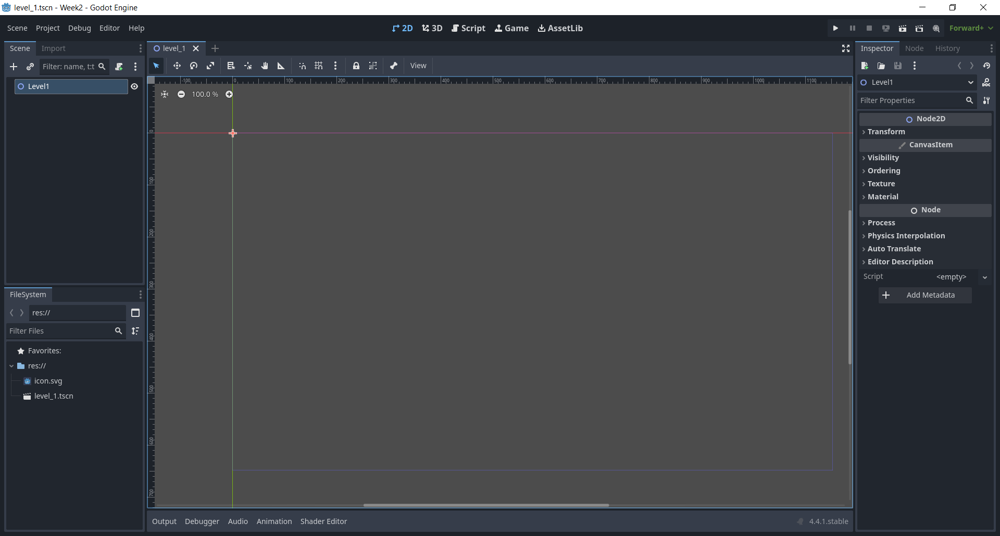
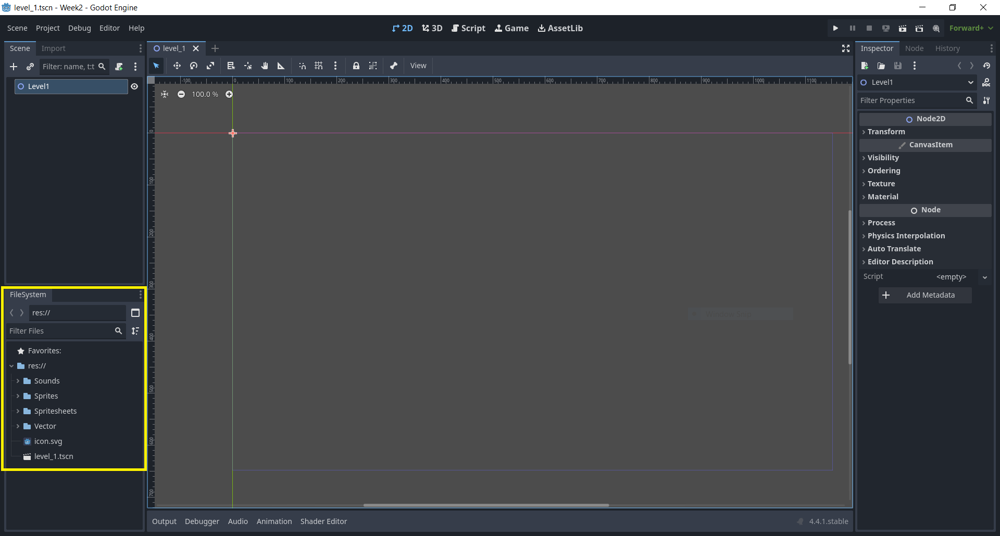
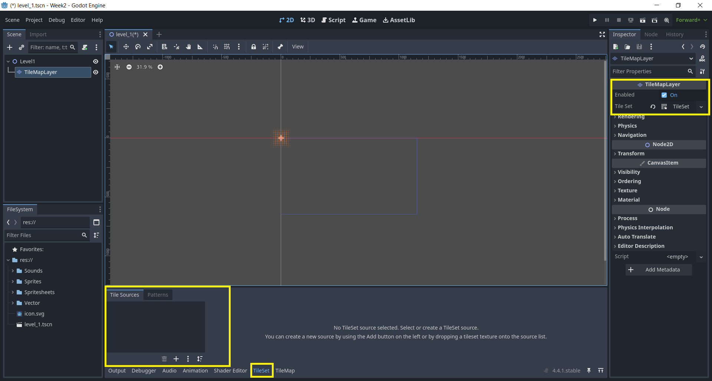
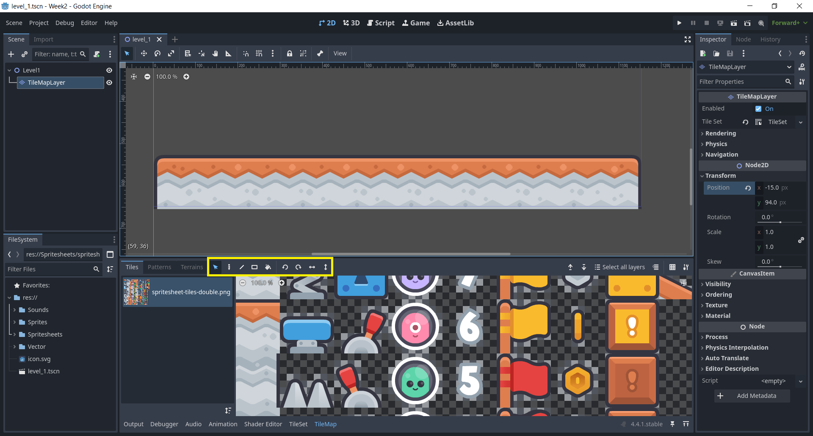
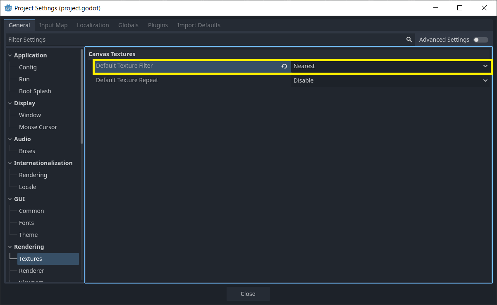
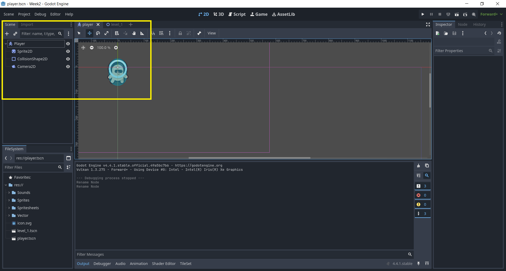
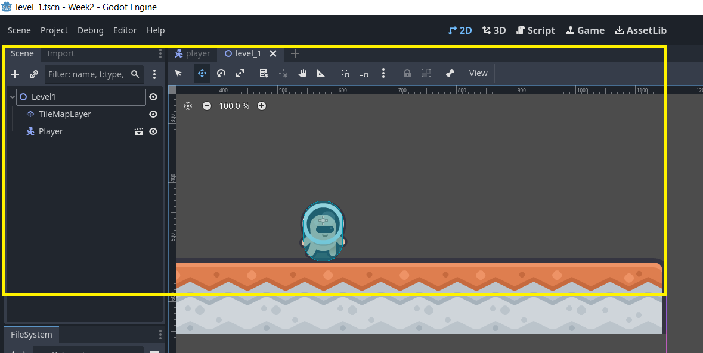

# Week 02

## Previous Class

Link to the previous class: [Week 01]()

---

## Before We Start

Open your repository in **Visual Studio Code**. Create a new branch called **week-02-formative-assessment** from **week-01-formative-assessment**.

---

## Create a Godot Project

Open **Godot** and create a new project called **Tilemap**. 

> **Note:** I have called the project **Week2**. This is not a good name for a project, but it is fine for demonstration purposes. You should always use meaningful names for your projects.

---

## Tilemap

You have previously learned about tilemaps in the context of **2D games**. In this class, you will learn how to use tilemaps in **Godot**.

> **Note:** You will developing a **2D platformer** game. You will use tilemaps to create the levels of your game.

---

## Create a Level Scene

Create a new `2D Scene` node and name it `Level1`. Save the scene in the `res` folder as `level_1.tscn`.

---

## Assets

You will need to find some assets to use in your game. You can use any assets you like, but I recommend using the following:

- [OpenGameArt](https://opengameart.org/)
- [Kenney Assets](https://kenney.nl/assets)
- [itch.io](https://itch.io/game-assets/free)
- [GameDev Market](https://www.gamedevmarket.net/)
- [CraftPix](https://craftpix.net/freebies/)

Import the assets you want to use into your project. You can do this by dragging and dropping the files into the `FileSystem`.

---

## Create a Tilemap

Add a new `TileMapLayer` node to the `Level1` node. In the `Inspector`, set the `Tile Set` property to a `New TileSet`. At the bottom, you will see a `TileSet` tab. Click on it and drag and drop your tileset images in the `Tile Source` section.

---

## Create a Platform

Next to the `TileSet` tab, you will see a `TileMap` tab. Click on it and select the tile(s) you want to use. You can then draw the platform in the scene by clicking and dragging.

---

## Rendering Texture

In the **Project** menu, select **Project Settings**. In the `Rendering` >  `Texture` section, set the `Default Texture Filter` to `Nearest`. This will make the tiles look pixelated, which may be what you want for your game.

---

## Create a Player

Create a new `CharacterBody2D` node and name it `Player`. Add `Sprite2D`, `CollisionShape2D` and `Camera2D` nodes as children of the `Player` node. In the `Inspector`, set the `Texture` property to the player sprite you want to use. 

---

## Add Player to Level

Drag and drop the `Player` scene into the `Level1` scene. Position it where you want the player to start. 

Run the game to see the player in the level. 

---

## Formative Assessment

Learning to use AI tools is an important skill. While AI tools are powerful, you **must** be aware of the following:

- If you provide an AI tool with a prompt that is not refined enough, it may generate a not-so-useful response
- Do not trust the AI tool's responses blindly. You **must** still use your judgement and may need to do additional research to determine if the response is correct
- Acknowledge what AI tool you have used. In the assessment's repository **README.md** file, please include what prompt(s) you provided to the AI tool and how you used the response(s) to help you with your work

---

### Task One

Create three different levels. Each level should have a different layout and use different tiles. You can use the same tileset for all levels, but you should create different platforms and obstacles.

---

# Independent Research

In this section, you will independently undertake research on concepts not covered in the course.

---

### Task One

Create a parallax background for your levels. You can use multiple layers of images that move at different speeds to create a sense of depth. The background should not distract from the gameplay, but it should add to the overall aesthetic of the game.

---

## Next Class

Link to the next class: [Week 03]()
