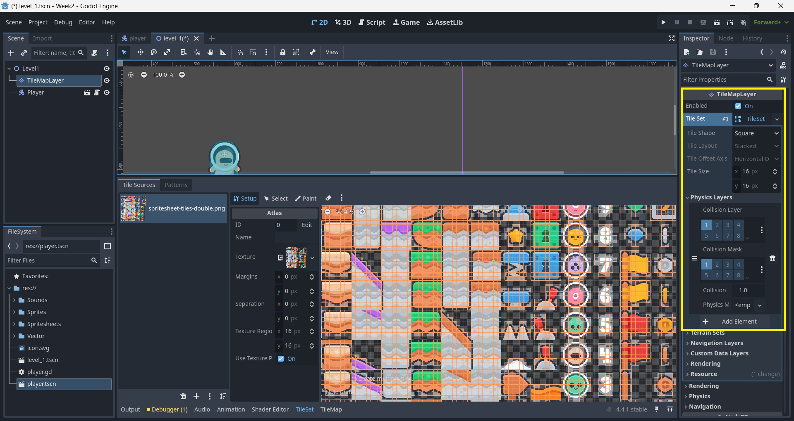
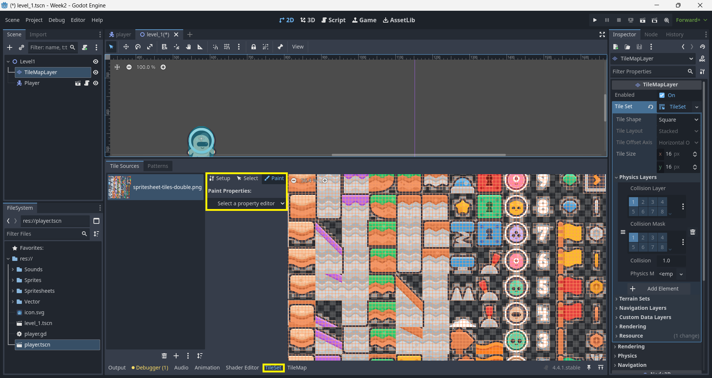
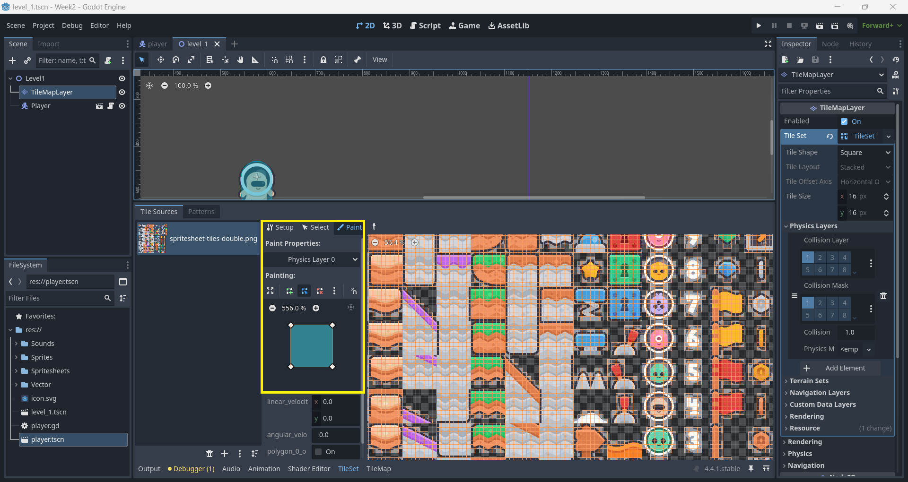
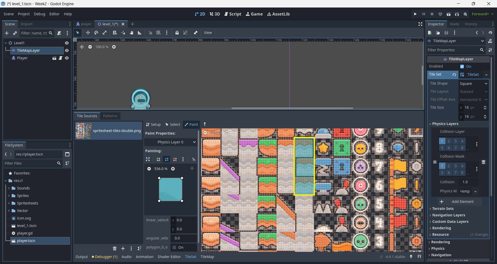

# Week 03

## Previous Class

Link to the previous class: [Week 02]()

---

## Before We Start

Open your repository in **Visual Studio Code**. Create a new branch called **week-03-formative-assessment** from **week-02-formative-assessment**.

---

## Open and Import Godot Project

Open **Godot** and import the project you created in the previous class. 

---

## Input Map

In the **Project** menu, select **Project Settings**. In the `Input Map` section, add the following actions:

- `left`
- `right`
- `jump`
- `shoot`

For each action, you can assign a key or button by clicking the **Add Key** button.

## Player

Open the `Player` scene you created in the previous class. 

Create a new script for the `Player` scene. 

In the script, add the following code:

```gdscript
extends CharacterBody2D

var direction_x: float := 0.0

@export var speed: float := 150.0

func _process(delta: float) -> void:
	get_input()
	apply_gravity()

	velocity.x = direction_x * speed
	move_and_slide()

func get_input() -> void:
	direction_x = Input.get_axis("left", "right")

	if Input.is_action_just_pressed("jump"):
		velocity.y = -400.0 # Adjust the jump height as needed

func apply_gravity() -> void:
	velocity.y += 20.0
```

What is happening here?

- `move_and_slide()`: This function is used to move the player character while handling collisions automatically.

- `get_input()`: Checks for player input. It sets the `direction_x` variable based on the left and right input actions. If the jump action is pressed, it applies an upward velocity.
  
- `apply_gravity()`: Applies gravity to the player by increasing the vertical velocity. This simulates the effect of gravity pulling the player down.

Run the `Level1` scene to see the player in action. You should be able to move left and right and jump. However, the player will fall through the ground because we have not set up collision detection yet.

---

## Tilemap Collision

Click on the `TileMapLayer` node in the `Level1` scene. In the `Inspector`, find the `Physics Layer` section and click on the `Add Element` button. This will add a new physics layer for the tilemap.



Click on the `TileSet` tab at the bottom. Click on the `Select a property editor` button, then `Physics Layer 0` in the `Physics` section. 



You should see the `Paint Properties` and `Painting` sections. The `Painting` section allows you to set the collision shape for the tiles. 



In your tileset, select the tile you want to use for collision. In the `Paint Properties` section, set the `Collision Shape` to `RectangleShape2D`. You can adjust the size of the collision shape to fit the tile.



Run the `Level1` scene again. You should now be able to collide with the tilemap and not fall through the ground.

---

## Formative Assessment

Learning to use AI tools is an important skill. While AI tools are powerful, you **must** be aware of the following:

- If you provide an AI tool with a prompt that is not refined enough, it may generate a not-so-useful response
- Do not trust the AI tool's responses blindly. You **must** still use your judgement and may need to do additional research to determine if the response is correct
- Acknowledge what AI tool you have used. In the assessment's repository **README.md** file, please include what prompt(s) you provided to the AI tool and how you used the response(s) to help you with your work

---

### Task One

You will notice if you press the jump key multiple times, the player will jump multiple times in the air. This is because we have not implemented a check to see if the player is on the ground before allowing them to jump.

In **Godot**, you can use the `is_on_floor()` method to check if the player is on the ground. Update the `get_input()` function in the `Player` script to include this check.

---

# Independent Research

In this section, you will independently undertake research on concepts not covered in the course.

---

### Task One

In the previous class's formative assessment, you created three levels. Add a node to the first and second levels that will allow the player move to the next level when they collide with it. At the end of the third level, add a node that will end the game when the player collides with it.

---

## Next Class

Link to the next class: [Week 03]()
