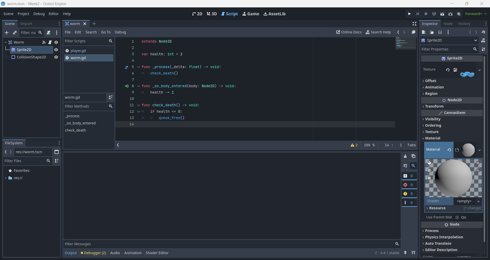
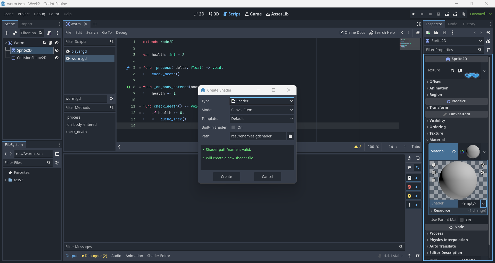

# Week 04

## Previous Class

Link to the previous class: [Week 03]()

---

## Before We Start

Open your repository in **Visual Studio Code**. Create a new branch called **week-04-formative-assessment** from **week-03-formative-assessment**.

---

## Open and Import Godot Project

Open **Godot** and import the project you created in the previous class. 

---

## Create an Enemy

Create a new `Area2D` node and name it `Worm`. Add `Sprite2D`, `CollisionShape2D` nodes as children of the `Worm` node. In the `Inspector`, set the `Texture` property to the worm sprite you want to use. 

---

## Worm Script

Create a new script for the `Worm` scene.

In the script, add the following code:

"`gdscript
extends Node2D

var health: int = 5

func _process(_delta: float) -> void:
 check_death()

func _on_body_entered(body: Node2D) -> void:
 health -= 1

func check_death() -> void:
 if health <= 0:
 queue_free()
```

What is happening here?

- `check_death()` checks if the worm's health is less than or equal to zero. If it is, the worm is removed from the scene using `queue_free()`.
  
- `_on_body_entered(body: Node2D)` is a signal emitted when another body enters the `Worm`'s collision area. In this case, it reduces the worm's health by 1 when the player collides with it. Make sure to connect this signal to the `Worm` node.

> **Note:** If a parameter is not used, you can use an underscore (`_`) before the parameter name to indicate that it is intentionally unused.

---

## Shaders

**Godot** uses a shading language similar to GLSL (OpenGL Shading Language). You will create a simple shader to change the colour of the worm when it is hit.

Click on the `Sprite2D` node of the `Worm` and in the `Inspector`, find the `Material` property. Click on the dropdown and select **New ShaderMaterial**. Then, click on the newly created `ShaderMaterial` and create a new shader by clicking on **New Shader**. 



Name the shader `enemies.gdshader` and open it. 



Replace the default code with the following:

```glsl
shader_type canvas_item;

uniform vec3 color: source_color = vec3(1.0);

uniform float amount: hint_range(0.0, 1.0) = 0.0;

void fragment() {
 // Get the original colour of the texture at the current UV coordinates
 vec3 original_color = texture(TEXTURE, UV).rgb; 

 // Mix the original colour with the specified colour based on the amount
 COLOR.rgb = mix(original_color, color, amount); 
}
```

What is happening here?

- `shader_type canvas_item;` indicates that this shader is for 2D canvas items.
- 
- `uniform vec3 color` defines a uniform variable `color` that can be set from the editor or code, with a default value of white.
  
- `uniform float amount` defines a uniform variable `amount` that controls how much the colour will change, with a default value of 0.
  
- `void fragment()` is the main function that runs for each pixel. It mixes the original colour of the texture with the specified `color` based on the `amount`.

---

## Tween

In **Godot**, a `Tween` creates smooth transitions between values over time. In the script, update the `_on_body_entered(body: Node2D)` function to create a `Tween` that will animate the `amount` property of the shader when the player collides with the worm:

"`gdscript
# ...

func _on_body_entered(body: Node2D) -> void:
 health -= 1
 var tween: Tween = create_tween()
 tween.tween_property($Sprite2D, "material:shader_parameter/amount", 1.0, 0.0)
 tween.tween_property($Sprite2D, "material:shader_parameter/amount", 0.0, 0.1).set_delay(0.2)

# ...
```

What is happening here?

- `create_tween()` creates a new `Tween` instance.
  
- 'tween.tween_property($Sprite2D, "material:shader_parameter/amount", 1.0, 0.0)` animates the `amount` property of the shader to 1.0 over 0 seconds, which will change the worm's colour to the specified `color`.

- 'tween.tween_property($Sprite2D, "material:shader_parameter/amount", 0.0, 0.1).set_delay(0.2)` animates the `amount` property back to 0.0 over 0.1 seconds after a delay of 0.2 seconds, returning the worm's colour to its original state.

> **Note:** If you are using an `AnimatedSprite2D` instead of a `Sprite2D`, you will need to adjust the code accordingly:

"`gdscript
tween.tween_property($AnimatedSprite2D, "material:shader_parameter/amount", 1.0, 0.0)
tween.tween_property($AnimatedSprite2D, "material:shader_parameter/amount", 0.0, 0.1).set_delay(0.2)
``` 

Drag and drop the `Worm` scene into the `Level1` scene. Position it where you want the worm to start. Run the game to see the worm in the level. When the player collides with the worm, it should change colour and reduce its health.

---

## Formative Assessment

Learning to use AI tools is an important skill. While AI tools are powerful, you **must** be aware of the following:

- If you provide an AI tool with a prompt that is not refined enough, it may generate a not-so-useful response
- Do not trust the AI tool's responses blindly. You **must** still use your judgement and may need to do additional research to determine if the response is correct
- Acknowledge what AI tool you have used. In the assessment's repository **README.md** file, please include what prompt(s) you provided to the AI tool and how you used the response(s) to help you with your work

---

### Task One

Implement movement for the worm. The worm should change direction when it collides with a wall or reaches the edge of a platform.

---

# Independent Research

In this section, you will independently research concepts not covered in the course.

---

### Task One

Implement four pick-up items with different effects. 

---

### Task Two

Create two enemies with different movement behaviours.

---

## Next Class

Link to the next class: [Week 03]()
