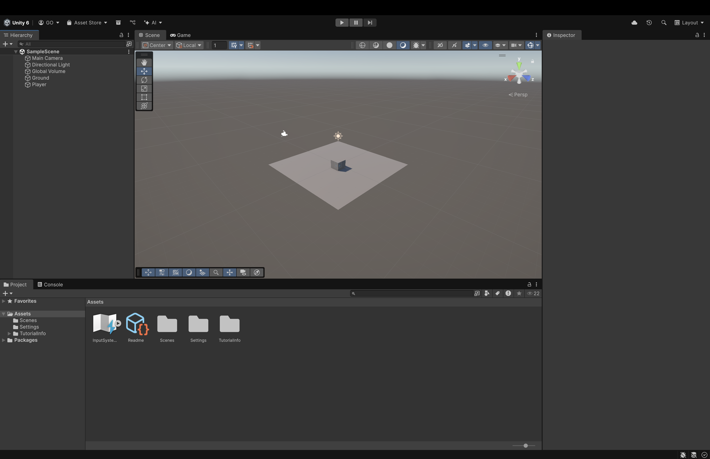
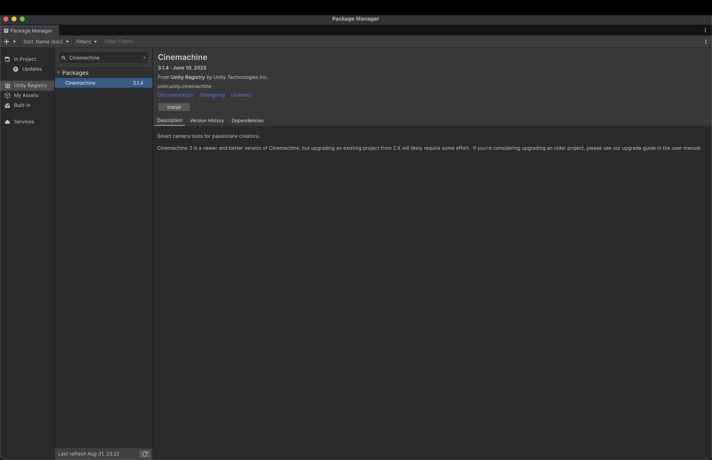
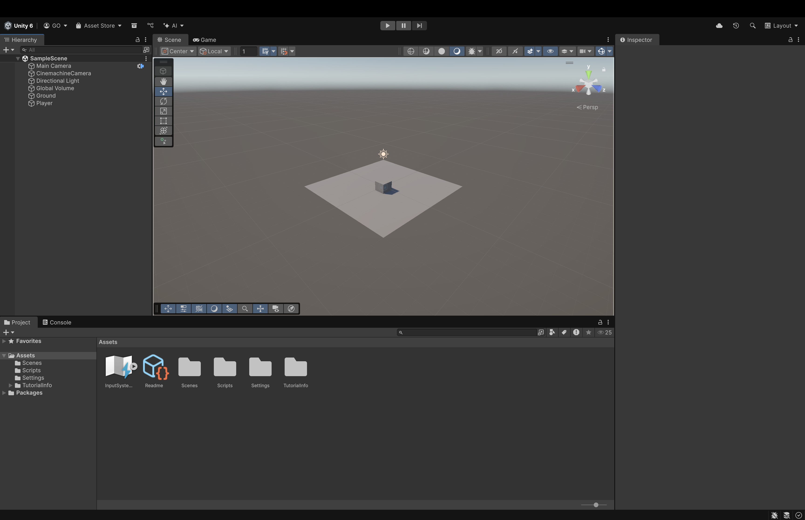
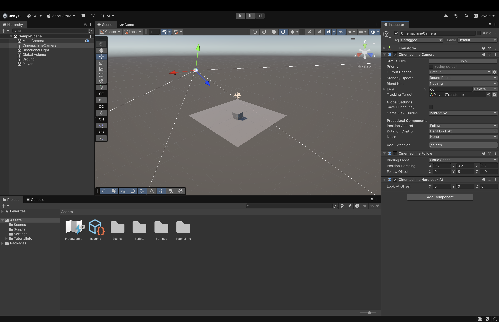

# Week 04

## Previous Class

Link to the previous class: [Week 03](https://github.com/otago-polytechnic-bit-courses/ID608001-intermediate-app-dev-concepts/tree/s2-25/lecture-notes/game-development-stream/03-player.md)

---

## Before We Start

Open your repository in **Visual Studio Code**. Create a new branch called **week-08-cinemachine** from **week-03-player**.

---

## Unity 

**Unity** is a cross-platform game engine and integrated development environment developed by **Unity Technologies**. It is used to develop 2D, 3D, augmented reality (AR) and virtual reality (VR) games. It is known for being user-friendly, making it an excellent choice for beginners.

---

### Unity Hub

**Unity Hub** is a management tool that allows you to manage multiple **Unity** projects. It also allows you to install different versions of **Unity**. You can download **Unity Hub** from the following link: <https://unity.com/download>.

---

### Unity Version

For this module, you should use **Unity 6**. You can download this version from the following link: <https://unity.com/releases/unity-6>.

---

### Unity Project

Open **Unity Hub** and click on the **New project** button. Select the **Universal 3D** template, name your project `obstacle-dodge` and select a location to save your project. Click on the **Create project** button.

---

## 3D Objects

In Unity, 3D objects are the building blocks of your 3D environment. You can create and manipulate 3D objects using the **GameObject** menu or by importing 3D models from external software.

---

### Creating 3D Objects

1. In the **Hierarchy** window, right-click and select **3D Object**.
2. Choose the type of 3D object you want to create (e.g., Cube, Sphere, Capsule).
3. The new 3D object will appear in the scene.

Here is an example of a Plane **Game Object** called `Ground` and Cube **Game Object** called `Player`:

---

## Cinemachine

**Cinemachine** is a suite of tools in Unity that allows you to create sophisticated camera behaviors easily. It provides a way to create smooth, dynamic camera movements and transitions without needing to write complex code.

---

### Setting Up Cinemachine

1. In Unity, go to the **Package Manager** (Window > Package Manager).
2. Search for **Cinemachine** and install it.

3. In the **Hierarchy** window, right-click and select **Cinemachine** > **Cinemachine Camera**. The `Main Camera` will have an additional component called `CinemachineBrain`, which is responsible for managing the virtual cameras and blending between them.

4. In the **Inspector** window, you can adjust the settings of the `CinemachineCamera` **Game Object** to achieve the desired camera behaviour. For example, `Target Tracking` allows you to specify which object the camera should follow, `Position Control` lets you define how the camera should move in relation to the target and `Rotation Control` determines how the camera should rotate to follow the target.

---

## Exercises

Learning to use AI tools is an important skill. While AI tools are powerful, you **must** be aware of the following:

- If you provide an AI tool with a prompt that is not refined enough, it may generate a not-so-useful response
- Do not trust the AI tool's responses blindly. You **must** still use your judgement and may need to do additional research to determine if the response is correct
- Acknowledge what AI tool you have used. In the assessment's repository **README.md** file, please include what prompt(s) you provided to the AI tool and how you used the response(s) to help you with your work

---

### Task 1

In the `Assets` directory, create a new folder called `Scripts`. Inside the `Scripts` folder, create a new C# script called `PlayerController.cs`. This script will be used to control the player's movement.

---

### Task 2

Create walls around the `Ground` **Game Object**. Apply materials to the walls to give them a distinct appearance.

---

### Task 3

Create collisions between the `Player` **Game Object** and the walls. 

---

### Task 4

Create a new **Scene** called `LevelOne`. Save the scene in the `Scenes` folder. Create an obstacle environment that has a start and finish. Use **Stumble Guys** as a reference for the obstacle design.

---