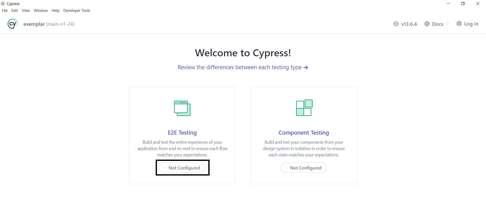
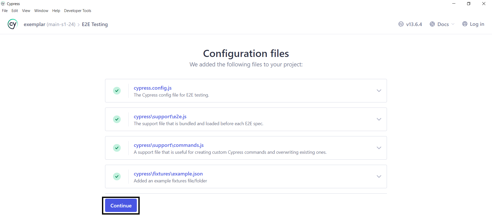
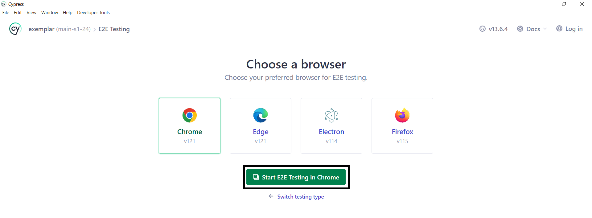
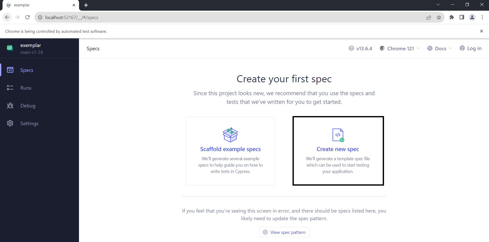
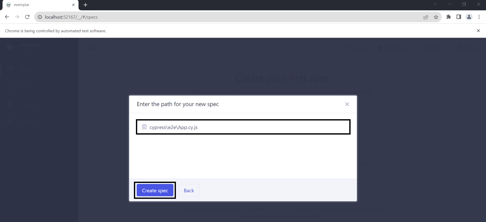
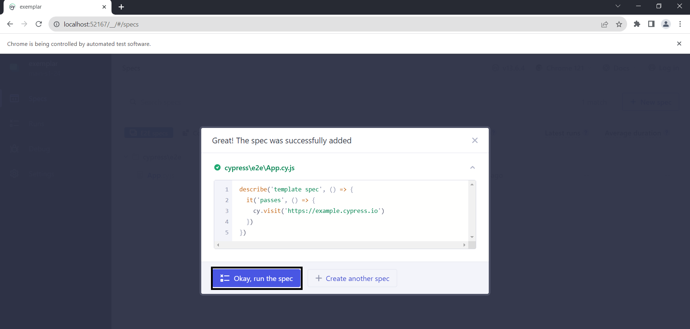
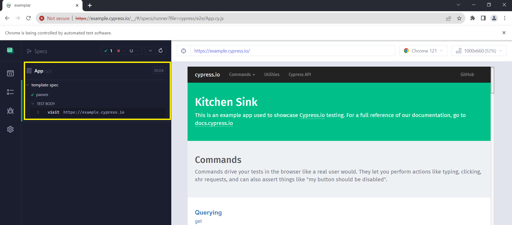

# Week 06

## Before We Start

Open your **s2-24-intermediate-app-dev-repo-GitHub username** repository in **Visual Studio Code**. Create a new branch called **week-06-formative-assessment** from **week-05-formative-assessment**.

> **Note:** There are a lot of code examples. Typing the code examples rather than copying and pasting is strongly recommended. It will help you remember the code better. Read the comments in the code examples. It will help you understand where to type the code. Also, some code examples may show **TypeScript** warnings.

---

## Create a New Vite Project

1. Create a new project using **Create Vite App**:

```bash
npm init vite@latest
```

2. When prompted, select the following options:

- Project name: **week-06-formative-assessment**
- Framework: **React**
- Variant: **TypeScript + SWC**

3. Change into the project directory:

```bash
cd week-05-formative-assessment
```

4. Install the project dependencies:

```bash
npm install
```

5. Start the development server:

```bash
npm run dev
```

6. Open your browser and navigate to <http://localhost:5173>. You should see the default **React** application.

---

## Vitest

**Vitest** is a testing framework for **Vite**. It is highly configurable and can be extended with **plugins**.

**Resource:** <https://vitest.dev>

---

## React Testing Library

**React Testing Library** is a library for testing **React** components. It is designed to test the output of your components from the perspective of the user. For example, you can test if a component renders a specific piece of text.

1. Install the following dependencies:

```bash
npm install @testing-library/dom@9.3.4 @testing-library/jest-dom@6.5.0 @testing-library/react@14.2.1 @testing-library/user-event@14.5.2 @vitest/coverage-v8@1.2.2 @vitest/ui@1.2.2 jsdom@24.0.0 vitest@1.2.2 --save-dev
```

2. In the `src` directory, create a new file called `App.test.tsx`.

3. Add the following code to the `App.test.tsx` file:

```javascript
import { render, screen } from "@testing-library/react";
import userEvent from "@testing-library/user-event";
import { describe, expect, it } from "vitest";

import App from "./App";

describe("Tests", () => {
  it("should render Pride and Prejudice", () => {
    render(<App />);
    expect(screen.getByText("Pride and Prejudice"));
  });

  it("should click on the first Add to Cart button", () => {
    render(<App />);
    const button = screen.getAllByTestId("add-to-cart-1")[0];
    userEvent.click(button);
  });
});
```

4. In the `package.json` file, add the following scripts:

```json
"test": "vitest",
"test:coverage": "vitest run --coverage",
"test:ui": "vitest --ui"
```

5. In the `vite.config.ts` file, add the following:

```ts
import { defineConfig } from 'vite'
import react from '@vitejs/plugin-react-swc'

// https://vitejs.dev/config/
export default defineConfig({
  plugins: [react()],

  // This object
  test: {
    environment: "jsdom",
  },
})
```

6. Run each script above. For example, if you run `npm run test`, you should see the following output:

```bash
✓ src/App.test.tsx (1)
  ✓ Tests (1)
    ✓ should render Pride and Prejudice
```

7. Let us look at user events. For example, a button click. In `Book.tsx`, update the `button` element to include a `data-testid` prop:

```tsx
<button
  onClick={() =>
    dispatch(
      addToCart({
        id: props.id,
        name: props.name,
        price: props.price,
      })
    )
  }
  data-testid={`add-to-cart-${props.id}`}
>
  Add to cart
</button>
```
A `data-testid` prop can be given to any element. It is used to identify an element in a test.

8. In `App.test.tsx`, add the following test:

```js
it("should click on the first Add to cart button", () => {
  render(<App />);
  const button = screen.getAllByTestId("add-to-cart-1")[0]; // What happens if you change 1 to 10? Why? 
  userEvent.click(button);
});
```

9. If you run `npm run test`, you should see the following output:

```bash
✓ src/App.test.tsx (2)
  ✓ Tests (2)
    ✓ should render Pride and Prejudice
    ✓ should click on the first Add to cart button
```

---

## Cypress

**Cypress** is an end-to-end testing framework. It is designed to test your application from the perspective of the user. For example, you can test if a button click triggers a specific action.

1. Install the following dependency:

```bash
npm install cypress --save-dev
```

2. Create a new script in your `package.json` file:

```json
"cypress:open": "cypress open"
```

3. In the `tsconfig.json` file, update it with the following:

```js
{
  "compilerOptions": {
    "module": "ES2015"
  },
  "files": [],
  "references": [
    { "path": "./tsconfig.app.json" },
    { "path": "./tsconfig.node.json" }
  ]
}

```

4. Run the following command:

```bash
npm run cypress:open
```

5. You should see the **Cypress** window open. Click on the **E2E Testing > Not Configured** button.



6. Click on the **Continue** button.



7. Click on the **Start E2E Testing in Chrome** button.



8. Click on **Create new spec**.



9. Name the **spec** file `App.cy.js` and click on the **Create spec** button.
   


10. Click on the **Okay, run the spec** button.



11. **Cypress** will run the test and you should see the following output:



12. You need to make sure the development server is running. If it is not, run the following command:

```bash
npx vite --host
```

Why `npx vite --host`? **Cypress** is running in a different environment to the development server. The `--host` flag allows **Cypress** to access the development server. 

13. Update the `App.cy.js` file to include the following code:

```javascript
describe("Tests", () => {
  it("should render Pride and Prejudice", () => {
    cy.visit("<Network address>:5173/"); // Copy and paste the network address. Note: localhost will not work
    cy.contains("Pride and Prejudice").should("exist");
  });

  it("should click on the first Add to Cart button", () => {
    cy.visit("<Network address>:5173/");
    cy.get('[data-testid="add-to-cart-1"]').click();
  });
});
```

> **Note:** This is the equivalent of the **React Testing Library** tests we wrote earlier.

---

## Formative Assessment

If you get stuck on any of the following tasks, feel free to use **ChatGPT** permitting, you are aware of the following:

- If you provide **ChatGPT** with a prompt that is not refined enough, it may generate a not-so-useful response
- Do not trust **ChatGPT's** responses blindly. You must still use your judgement and may need to do additional research to determine if the response is correct
- Acknowledge that you are using **ChatGPT**. In the **README.md** file, please include what prompt(s) you provided to **ChatGPT** and how you used the response(s) to help you with your work

---

## Task One

Using the completed **week 03** formative assessment and **React Testing Library**, write tests for the following:

- Adding **1984** and **Crime and Punishment** to the cart.
- Checking if the total number of items in the cart is 2.
- Checking if the total price of the items in the cart is 20.

---

## Task Two

Using the completed **week 04** formative assessment and **Cypress**, write tests for the following:

- Adding an institution.
- Checking if the institution is added to the list of institutions.
- Updating the institution.
- Checking if the institution is updated in the list of institutions.
- Deleting the institution.
- Checking if the institution is deleted from the list of institutions.

---

### Submission

Create a new pull request and assign **grayson-orr** to review your practical submission. Please do not merge your own pull request.

